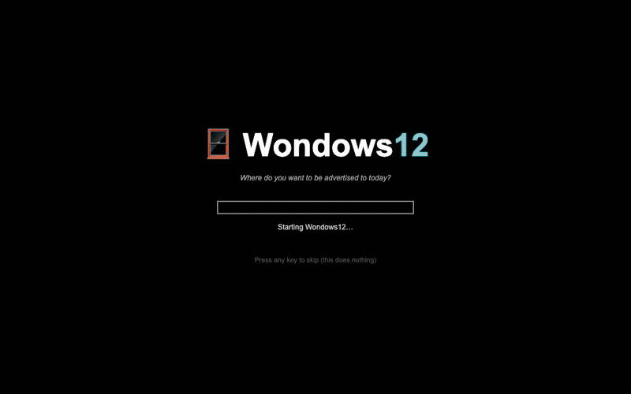

# Wondows12 🪟

*The operating system that is legally an operating system.*



## The game

You have one job: create a file called `win.txt` containing exactly

```
I did it!
```

and save it to `My Documents\win_files` (you'll have to create that folder yourself).

Standing between you and victory: an operating system with massively stochastic
behavior — errors that fire before the operations they describe, folders that
appear whenever they feel like it (sometimes twice, to be safe), a Save button
with a self-preservation instinct, SmartAssist™ "improving" your documents, and
giant pop-up ads for subscriptions nobody wants at terrible prices. RAM
Insurance™. PrinterInkPrime+. Premium CPU Oxygen. Cloud backup for your Recycle
Bin.

You start with $250.00. Subscriptions renew every 30 seconds (Wondows Time
Compression™). If your balance hits $0, your bank account is frozen and the
game is over. Some ads have fake close buttons. Read before you click.

Sessions run 3–5 minutes. The in-game `READ ME FIRST.txt` documents everything —
including a full command-prompt speedrun path for the brave. It will not be for
lack of documentation that you fail.

## Run it

```sh
npm install
npm run dev
```

Then open http://localhost:5173 and try to remain calm.

## Tech

React + Vite + Zustand + [98.css](https://jdan.github.io/98.css/). Everything is
in-memory — no backend, no persistence. All difficulty knobs (event
probabilities, chaos ramp, grace period, ad frequency) live in
`src/chaos/engine.ts`. The victory screen already computes a score, so a
Supabase leaderboard is a ten-minute add whenever we feel like it.

## Legal

Wondows12 is a parody and is not affiliated with, endorsed by, or emotionally
supported by any real operating system vendor, living or discontinued. By
reading this README you grant Wondows12 a non-exclusive, royalty-free,
fully transferable license to your left shoe.
